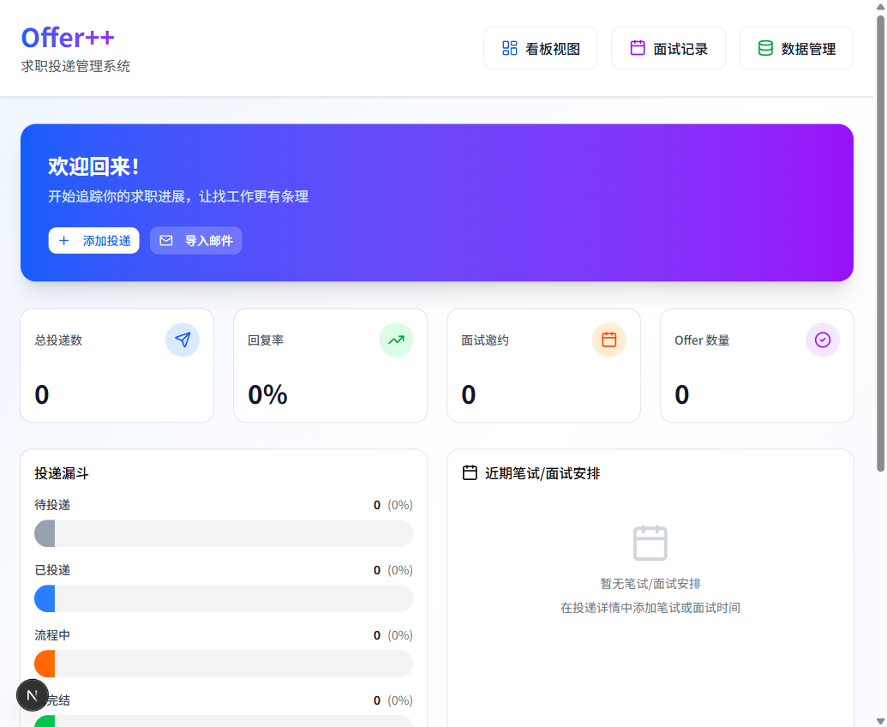
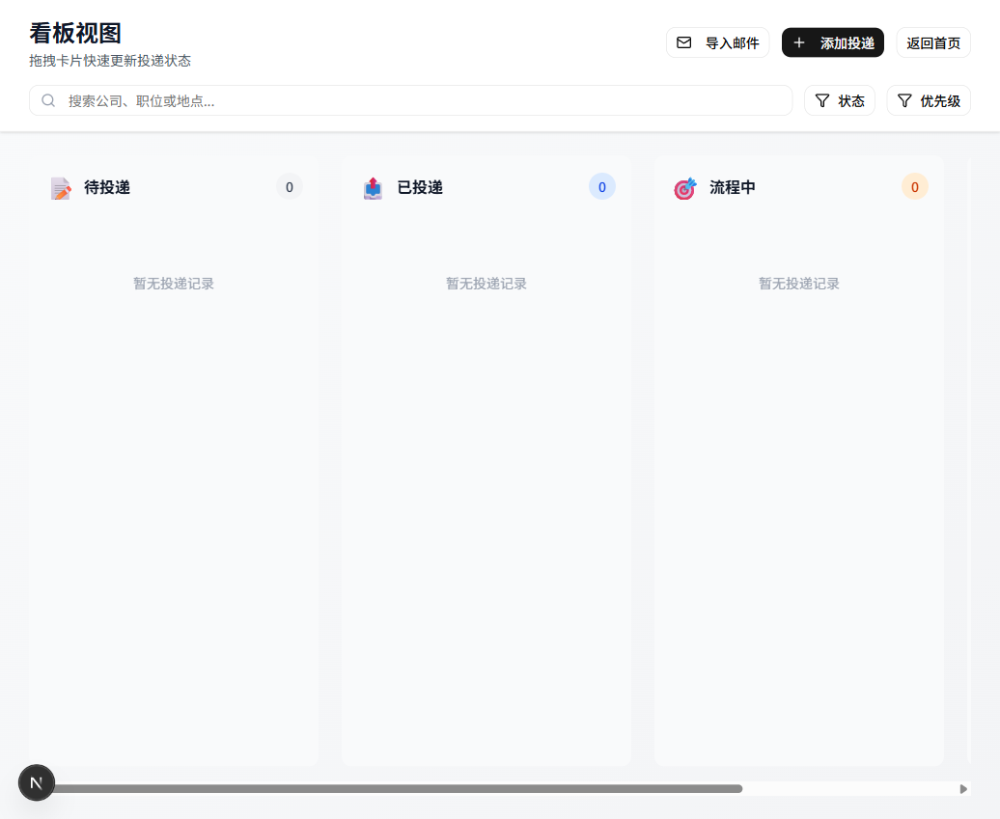
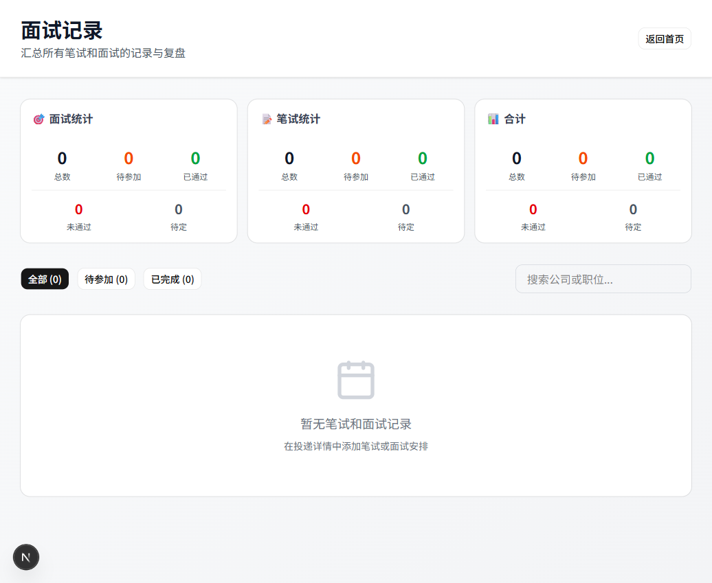

# Offer++ 求职投递管理系统

> 现代化的求职投递追踪和管理工具，帮助你高效管理求职全流程

[](https://nextjs.org/)
[](https://react.dev/)
[](https://www.typescriptlang.org/)
[](LICENSE)

## 📸 界面预览

<div align="center">

### 仪表板


### 看板管理


### 面试记录


</div>

## ✨ 核心特性

- 🎯 **看板式管理** - 拖拽式投递状态流转（待投递 → 已投递 → 面试中 → Offer → 已完结）
- 📝 **面试复盘** - 完整的面试/笔试记录，支持结构化问答对
- 📊 **数据统计** - 可视化分析求职进度和趋势
- ⏰ **智能提醒** - 近期面试/笔试安排自动提醒
- 🏷️ **优先级管理** - 高/中/低优先级标记
- 🔍 **快速搜索** - 公司、职位、状态多维度过滤
- 💾 **数据导出** - 支持 JSON 格式备份和恢复
- 🎨 **现代 UI** - 基于 Shadcn/ui 的精美界面

## 🚀 快速开始

### 前置要求

- Node.js 18.0+
- npm / yarn / pnpm

### 本地开发

```bash
# 1. 克隆项目
git clone <repository-url>
cd offer_dashboard

# 2. 安装依赖
npm install

# 3. 启动开发服务器
npm run dev

# 4. 打开浏览器访问
# http://localhost:3000
```

### 生产构建

```bash
# 构建
npm run build

# 本地预览
npm start
```

## 🌐 部署指南

### Vercel 部署（推荐）

[](https://vercel.com/new/clone)

**方式一：一键部署**
1. 点击上方按钮
2. 连接 GitHub 仓库
3. 自动完成部署

**方式二：CLI 部署**
```bash
npm install -g vercel
vercel login
vercel --prod
```

**配置说明：**
- Framework Preset: `Next.js`
- Build Command: `npm run build`
- Output Directory: `.next`
- Node.js Version: `18.x`

### Netlify 部署

[](https://app.netlify.com/start)

**部署配置：**
```toml
[build]
  command = "npm run build"
  publish = ".next"

[[plugins]]
  package = "@netlify/plugin-nextjs"
```

### Docker 部署

```bash
# 构建镜像
docker build -t offer-dashboard .

# 运行容器
docker run -p 3000:3000 offer-dashboard
```

### 自托管部署

适合部署到自己的服务器：

```bash
# 1. 构建项目
npm run build

# 2. 使用 PM2 管理进程
npm install -g pm2
pm2 start npm --name "offer-dashboard" -- start

# 3. 配置 Nginx 反向代理（可选）
```

**Nginx 配置示例：**
```nginx
server {
    listen 80;
    server_name your-domain.com;

    location / {
        proxy_pass http://localhost:3000;
        proxy_http_version 1.1;
        proxy_set_header Upgrade $http_upgrade;
        proxy_set_header Connection 'upgrade';
        proxy_set_header Host $host;
        proxy_cache_bypass $http_upgrade;
    }
}
```

## 🛠️ 技术栈

| 类别 | 技术 |
|------|------|
| **框架** | Next.js 16.3 (App Router) |
| **UI 库** | React 19.2 |
| **语言** | TypeScript 5 |
| **样式** | Tailwind CSS 4 |
| **组件** | Shadcn/ui + Radix UI |
| **状态管理** | Zustand |
| **拖拽** | @dnd-kit |
| **图表** | Recharts |
| **数据持久化** | localStorage |

## 📁 项目结构

```
offer_dashboard/
├── app/                      # Next.js App Router
│   ├── page.tsx             # 首页（仪表板）
│   ├── board/               # 看板页面
│   ├── interviews/          # 面试记录
│   ├── settings/            # 数据管理
│   └── layout.tsx           # 布局组件
├── components/              # React 组件
│   ├── board/              # 看板组件
│   ├── dashboard/          # 仪表板组件
│   ├── jobs/               # 投递管理组件
│   └── ui/                 # UI 基础组件
├── lib/                     # 核心逻辑
│   ├── store.ts            # Zustand 状态管理
│   ├── types.ts            # TypeScript 类型
│   ├── constants.ts        # 常量配置
│   └── utils.ts            # 工具函数
└── public/                  # 静态资源
```

## 💡 使用说明

### 数据备份（重要）

由于数据存储在浏览器 localStorage，**强烈建议定期备份**：

1. 进入「数据管理」页面
2. 点击「导出为 JSON」
3. 保存备份文件

### 数据迁移

更换设备或浏览器时：

1. 旧设备：导出数据
2. 新设备：导入数据文件
3. 完成迁移

### 浏览器兼容性

| 浏览器 | 支持情况 | 说明 |
|--------|---------|------|
| Chrome / Edge | ✅ 推荐 | 最佳体验 |
| Firefox | ✅ 支持 | 完整功能 |
| Safari | ✅ 支持 | 完整功能 |
| 隐私模式 | ⚠️ 受限 | 数据不持久化 |

## ⚠️ 重要提示

### 数据安全

- 数据存储在浏览器 localStorage
- 清除浏览器缓存会导致数据丢失
- 重装系统或换设备无法自动同步
- **务必定期导出备份**

### 存储限制

- localStorage 容量：约 5-10MB
- 建议投递记录：< 500 条
- 超出限制时请导出旧数据并清理

## 🤝 贡献

欢迎提交 Issue 和 Pull Request！

## 📝 开发计划

- [ ] 云端数据同步
- [ ] 多设备自动同步
- [ ] 移动端适配
- [ ] 数据可视化增强
- [ ] 导出 PDF 简历

## 📄 许可证

MIT License - 详见 [LICENSE](LICENSE)

## 🙏 致谢

- [Next.js](https://nextjs.org/) - React 框架
- [Shadcn/ui](https://ui.shadcn.com/) - UI 组件库
- [Vercel](https://vercel.com/) - 部署平台

---

**开发者**: [shiwei](https://github.com/your-username)  
**最后更新**: 2026-08-18  

如有问题或建议，欢迎提 [Issue](../../issues)
